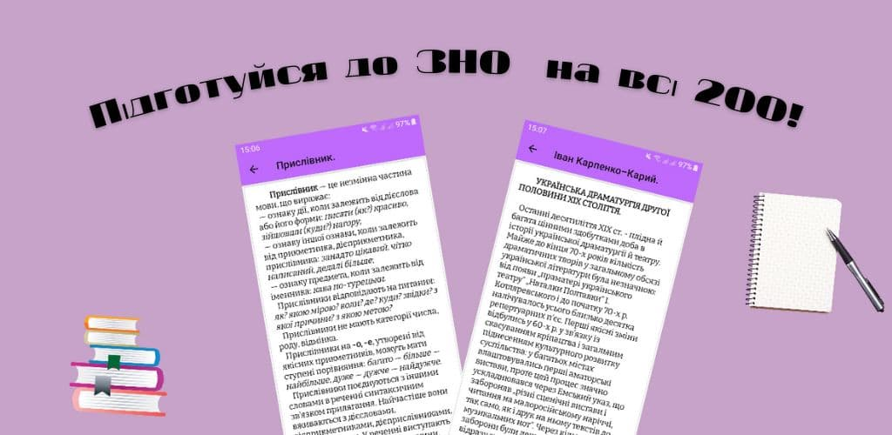

#  :notebook_with_decorative_cover::open_book: **ZNO application for Ukrainian student**
## The application is a directory that helps graduates 11 classes prepare for the exam in the Ukrainian language and literature.

## This project uses:
* Java; 
* Collections; 
* UI design.
## Link on Google Play: https://tinyurl.com/ladoshko
## This application was made in IDE Android Studio. For project build use Gradle and Android Studio:
* Click the button "Code" and download the ZIP-file;
* In Android Studio click "Import project";
* IDE will collect this project.
## If you will use command line:
* clone branch review with git clone or fork it and then clone it from your forked repo;
* cd zno-ukr;
* npm install;
* npm start.
